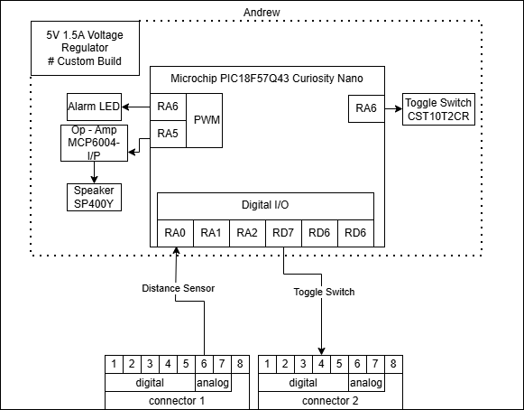

## Overview
Microcontroller Subsystem tasked with Audio-Visual Alarm processes.

## Block Diagram 

## Resources
The source drawio file is available [*here*](https://viewer.diagrams.net/?tags=%7B%7D&lightbox=1&highlight=0000ff&edit=_blank&layers=1&nav=1&title=INDIVIDUAL&dark=auto#R%3Cmxfile%3E%3Cdiagram%20name%3D%22Page-1%22%20id%3D%22QpGGdMiPVVgRiFB68Lla%22%3E1Vxfd6I4FP80PnYOJKDwaLUzO%2Be0O26dM50%2BUkkxWyQuxGrn029QQMJFBRVIH3pKLkkIv%2Fv%2FktjDo8XmW%2Bgs5w%2FMJX4Pae6mh8c9hHRDw%2BJfTPnYUWyk7QheSN2k054wpX9IQky7rahLIqkjZ8zndCkTZywIyIxLNCcM2Vru9sp8%2BalLxyOAMJ05PqQ%2BUZfPd1TL1Pb0vwj15umTdS25s3DSzgkhmjsuW%2BdI%2BK6HRyFjfHe12IyIH4OX4rIb9%2FXA3WxhIQl4lQHuf1P9I8T0%2FlZ74U%2F3k%2FcfwdNNMsu746%2BSFx4GbkjWyZL5R4pDyFaBS%2BKptB6%2BXc8pJ9OlM4vvrgXnBW3OF75o6eLynYScCgyHPvUCQeMs7gAXnD5ddCebHCl5gW%2BELQgPP0SX9C42d0MSaTISbNd71phWQpvn2GKYiRg6iTh42dR7xMRFAloNABEA8IHOQjab06UgT76PdOurOfjHEM%2FXRquQsojy%2BIX%2BdgLWBMiv1PdHzGehoAQsEENvF%2Bzdedk%2BIh4Wkoj%2BybcZd3iuLRSY5NvEpfmmz2Zv2QoTpcvdvgKPsaZLPNZ1DJiM%2BiVMRqnqXZ3JGDAZsM4TvFuqArbcdW%2BCqjMB2bbEBGSWMMFEkAn9pnhgAB48DjXAhloaBPE7yv3qVkqTsMPQSBkl4oubQs4skd6%2Bz2Pxo%2B%2Fi0osvH4cZVTwkd0NNiG21IO6XCKeuJnKmWsgNIHLjgZrI6Vgt6KwS6PqKQjdQCzr780CnmjdJl5PDbkw9EbbEI7%2BLKX9chmNJAFse6XYbaV03UshHVWXcbCyq0mECOHl6uIyDTsKmcLf%2BRnICA4ajZXlfc7jBDIC4HpkmTRbyOfNY4Ph3e%2BqtjOK%2Bzz2LBXqL3b%2BE84%2BkCuKsOJORJRvKfyfD4%2Bvn%2BPqLmbTGm9yt8UfaCMT7%2Fk4niBu5UXFzP2zbSscd5FrEVuGMHMMm4Q13Qo8cUxc9ielj5I5KQUh8h9N3uSRzfZ6WpXklgXK%2FnUC5ESVp11XAnK0E0KHvhAvR6%2F5urCiwSLNPAltWkGgO2LKUrrQg0WCFwJSlzcAQFL0MleZsMszCktcUwQTSLszHikHIC%2BOcLarHBhnPTiPcHYIwG3PT2O6TYJfWq2BglVXm5ZphU1DC7MwRrp55nwbJTQG2w8iWOZXmgIW5WzuVlvMUGLWJDYK5GXQMHWOzOShG7UIFEx%2BsKFQlH7nahQoBqAxFoep3DRVMIUxFobK6hgomB%2B1U4C5wgZ1hBeP9dmrkZ2DVuWGHWYClKladW3YY7wOoms4jDaRaHolg6J7PIy%2BMqC6N4DOeKZxHIhijK5FH1sBOlTwSw5BehTyyBpKK5pEYJgDt5JHnKXCrfgHDiL%2BdPLK%2BWHUdbmAY8beTR9aHqutoA8OIv508sj5UXeeRGAb87eSR9aHqOo%2FEMN5vJ4%2B8wAV2hhWM99vJI8%2FAqnPDDrOAdvLIM7Dq3LLbAJlPthti0Nx2iJQ5J7dDGEmMdb3tENuhwzB0PnIdlowGPMrNPIkJvcPbCGycFxDQH1n2Rf2RZhUEcLfivThmr36%2BhBowjSrd22EqugUBMGXQ8d4OAyZLbap8pubPuTsnVD635%2BlZ0vGrazyqqPHpXmxFNkCl6z6uJD%2Fig0034m%2B4WB7SFjDoYTTpa5pxE28QnSiqY1lpL9MxC%2BjYwIA6ZjSmYxXOHZHAHcbHHEVr5jtRRGcyLjKI5fqjVdUfzbJkt2lb%2BIQWbVsTElIBCQkvVq00Yzy9t7CqauWPDpYY0JRWz%2BeWOD3ZfuN%2B4UDi7s2TUUe8J06lLfWeVmGiHTJgotpRQL%2Bw4MFxr46Rfax%2FQ14dVhTGNOJOIGQIaVMSRHHFvsRN3TsvxO%2BV7lqeCZmMBRWUSBfUdXdeLLfVPJbmBEoxuXnbM8fVI%2F1Uvy%2F%2FiHIjdFMfyGdj07O9F0pu9l0rm9aQp2CvrxHhBWZfh70Vtjm2EXRcO4A4abzw1TdGn2UDDKOg08ZxG2DY%2BrH%2Bsg04%2FTT9TBNp6vIyjOJEB0zk1cQWVqR%2BMs%2FztzZpTflsrrJNMq9lk7Qvum7LERW6zCK1YHFggcz8Jdr6F3Mo%2Fv1iPo9%2FLwJpj8RbiZeI3QuIdXtod9g%2Fir%2BoIe12RX1X0ZBX78s61y%2F59l5WSWrulDesukFl2Ye8yQEx14nmW9R0GaGYPnG40J1gS0FaHK5GPGRv2a95oINBcppW1gmR8%2F5BP9c%2FnE4wBxUdSdpRkSjYsAeyPTg3CjaNwkQVTXxdD9gv149Dyyp2RyccZrE%2FRiccrF6vf1G9C%2F0bCsq7LQbXqAxdoICVa7pqVXjMSmXQ6ZI4bySsXNyZTgxNe1bUxRUPb6GuD2%2BZnVZOJadW9WOJ5NaaPDqa%2FqLM6copVkuvUBW9UvfoqFnYhKmnaUBnv1lT6SwuSKsqGqzR9Keu%2FUSjR1XZYRXZUe24e7ptpAY7RHP%2FE3S7EGD%2FQ3747n8%3D%3C%2Fdiagram%3E%3C%2Fmxfile%3E), and the pdf file available [*here*](INDIVIDUAL.png).
