## **Speaker**

1. CE-2808B36 Round Micro Speaker

    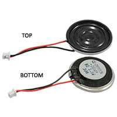

    * $0.85/each
    * [link to product](https://www.jameco.com/z/CE-2808B36-James-Electronics-Micro-Round-8-Ohm-Mylar-Speaker-92-dB-2-Watt-1-5-Wires_2302983.html)

    | Pros        | Cons                    |
    |-------------|-------------------------|
    | Inexpensive | Smaller Frequency Range |
 

2. SP-4005Y Dynamic Speaker Unit

    

    * $2/each
    * [Link to product](https://www.digikey.com/en/products/detail/soberton-inc/SP-4005Y/9924431)

    | Pros              | Cons                    |
    |-------------------|-------------------------|
    | Higher Efficiency | Smaller Frequency Range |

3. AST-02308MR-R General Purpose Speaker

    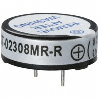

    * $3.36/each
    * [Link to product](https://www.digikey.com/en/products/detail/pui-audio-inc/AST-02308MR-R/1464874)

    | Pros                   | Cons      |
    |------------------------|-----------|
    | Higher Frequency Range | Expensive |
  
**Choice:** Option 2: SP-4005Y Dynamic Speaker Unit

**Rationale:** This Speaker has a high efficiency while keeping a relatively low price. Hence, it can provide louder and clearer sounds even off a low powered setup like the system we intend to build.

**---**

## **Switches**

1. R4ABLKBLKFF0 Rocker Switch

    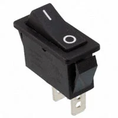

    * $1.39/each
    * [link to product](https://www.digikey.com/en/products/detail/e-switch/R4ABLKBLKFF0/1805256)

    | Pros                            | Cons                |
    |---------------------------------|---------------------|
    | More durable than other options | High Voltage Rating |
 

2. ESE-20D441 PushButton Switch

    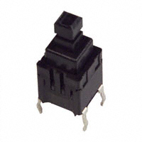

    * $0.88/each
    * [Link to product](https://www.digikey.com/en/products/detail/panasonic-electronic-components/ESE-20D441/593519)

    | Pros        | Cons                                                             |
    |-------------|------------------------------------------------------------------|
    | Inexpensive | Pushbuttons may be easy to miss or break in emergency situations |

3. CST10T2CR Relay Switch

    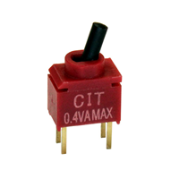

    * $2.65/each
    * [Link to product](https://www.digikey.com/en/products/detail/cit-relay-and-switch/CST10T2CR/12503245)

    | Pros         | Cons      |
    |--------------|-----------|
    | Relay System | Expensive |
  
**Choice:** Option 3: CST10T2CR Relay Switch

**Rationale:** This Relay system built into the switch would allow to control appliances with low power signals. This can be useful in protecting against high voltage passes and other hazardous conditions by safely switching circuits off to prevent damage.

**---**

## **Op-Amp**

1. LM358ADR Op Amp

    

    * $0.2/each
    * [link to product](https://www.digikey.com/en/products/detail/texas-instruments/LM358ADR/555721)

    | Pros        | Cons                    |
    |-------------|-------------------------|
    | InExpensive | Output not Rail to Rail |
 

2. MCP6004-I/P Op Amp

    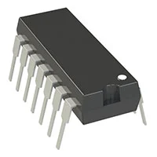

    * $0.6/each
    * [Link to product](https://www.digikey.com/en/products/detail/microchip-technology/MCP6004-I-P/523060)

    | Pros              | Cons      |
    |-------------------|-----------|
    | 4 Op-Amp Circuits | Expensive |

3. MCP6006UT-E/OT Op Amp

    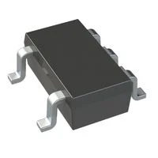

    * $0.2/each
    * [Link to product](https://www.digikey.com/en/products/detail/microchip-technology/MCP6006UT-E-OT/13985884)

    | Pros                       | Cons      |
    |----------------------------|-----------|
    | High Operating Temperature | 2 Circuit |
  
**Choice:** Option 2: MCP6004-I/P Op Amp

**Rationale:** This Op-Amp provides 4 Circuits that can be used all on one supply voltage. It is also already available to the team and hence has no cost.

**---**

## **5V Regulator**

1. AS78L05RTR-E1 Regulator

    

    * $0.12/each
    * [link to product](https://www.digikey.com/en/products/detail/diodes-incorporated/AS78L05RTR-E1/4470943)

    | Pros        | Cons                    |
    |-------------|-------------------------|
    | InExpensive | Lower Max Input Voltage |
 

2. AP7375-50SA-7 Regulator

    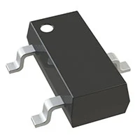

    * $0.25/each
    * [Link to product](https://www.digikey.com/en/products/detail/diodes-incorporated/AP7375-50SA-7/16400218)

    | Pros                           | Cons                   |
    |--------------------------------|------------------------|
    | Current Limit Control Feauture | Larger Voltage Dropoff |

3. Custom Made Regulator

    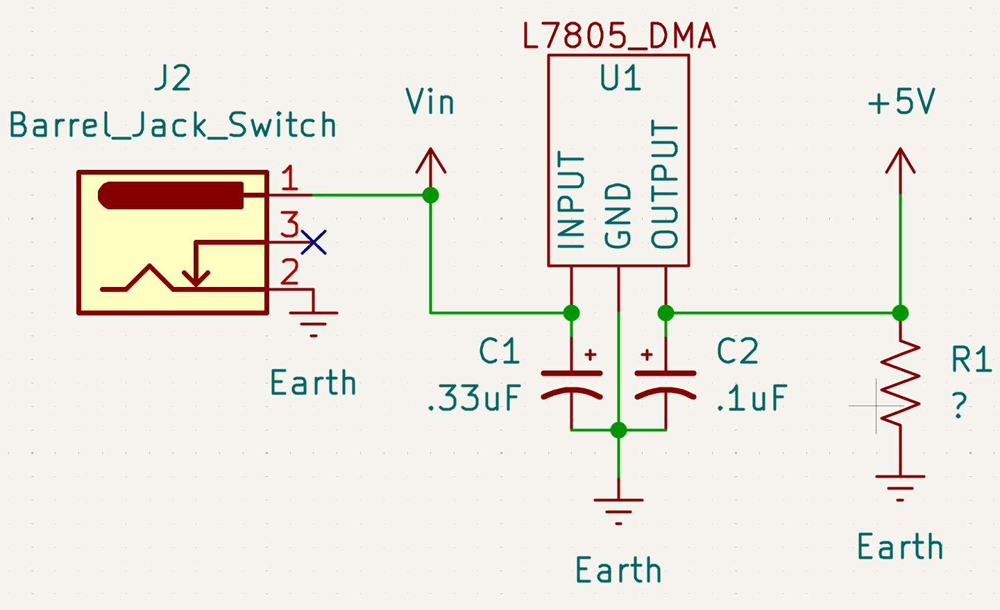

    * $0.0/each

    | Pros        | Cons                    |
    |-------------|-------------------------|
    | InExpensive | No Proper Documentation |
  
**Choice:** Option 2: Custom Made Regulator

**Rationale:** This Regulator offer customization on impedance and fuse ratings hence allowing for current control to protect lower rated components on the circuit and output control allowing for any voltage need by the components.

**---**

<!--

## **Microphone**

1. CMEJ-4618-42-LX Electric Condenser Microphone

    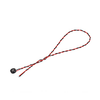

    * $0.83/each
    * [link to product](https://www.digikey.com/en/products/detail/same-sky-formerly-cui-devices/CMEJ-4618-42-L177/10253441)

    | Pros                                      | Cons                                                             |
    | ----------------------------------------- | ---------------------------------------------------------------- |
    | Inexpensive                               | Smaller Frequency Range|
 

2. AOM-4544P-2-R Omni-Directional Microphone 

    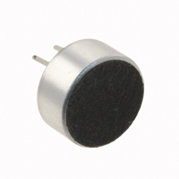

    * $1/each
    * [Link to product](https://www.digikey.com/en/products/detail/pui-audio-inc/AOM-4544P-2-R/1745492)

    | Pros                                                              | Cons                |
    | ----------------------------------------------------------------- | ------------------- |
    | Stable frequency response      | Pin Type Mounting(Requires special connection)

3. PMOF-9745W-42DQ Analog Microphone Electret Condenser

    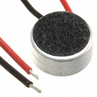

    * $1.82/each
    * [Link to product](https://www.digikey.com/en/products/detail/mallory-sonalert-products-inc/PMOF-9745W-42DQ/6564383)

    | Pros                                                              | Cons                |
    | ----------------------------------------------------------------- | ------------------- |
    | Higher Sensitivity Range for low profile environments                                     |Lower Signal to Noise ratio.      |
  
**Choice:** Option 2: AOM-4544P-2-R Omni-Directional Microphone

**Rationale:** This microphone is the better choice because it sits within the middle of the sensitivity range, price, and Signal to Noise rato of the other two microphones. Coupled with its stable frequency reducing the need for a filter, this microphone is the obvious choice. 
-->