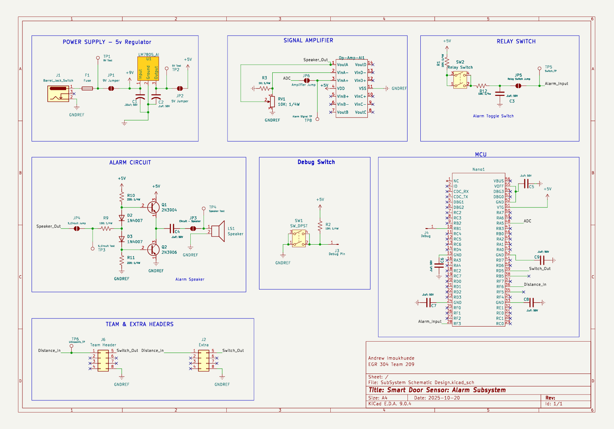

## Overview

This schematic is designed to support Alarm Systems in a Smart Door Sensor.

{style width:"350" height:"300;"}
**Figure 1:** Schematic Design.

## Resources

The schematic as a PDF download is available [*here*](Schematic.pdf), and the Zip folder of the project [*here*](AlarmSubsystemDesign.zip).
