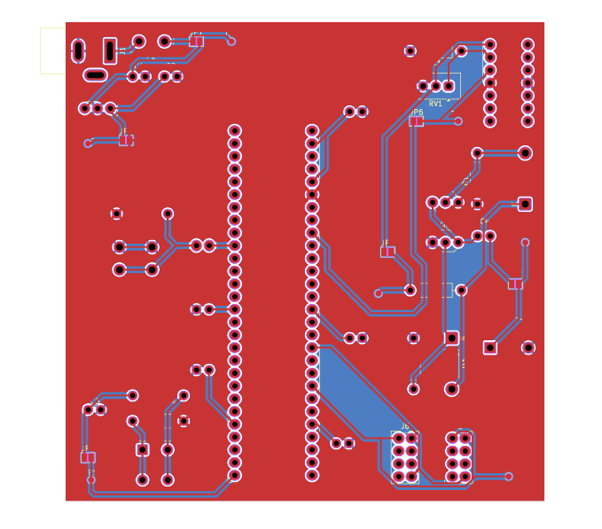
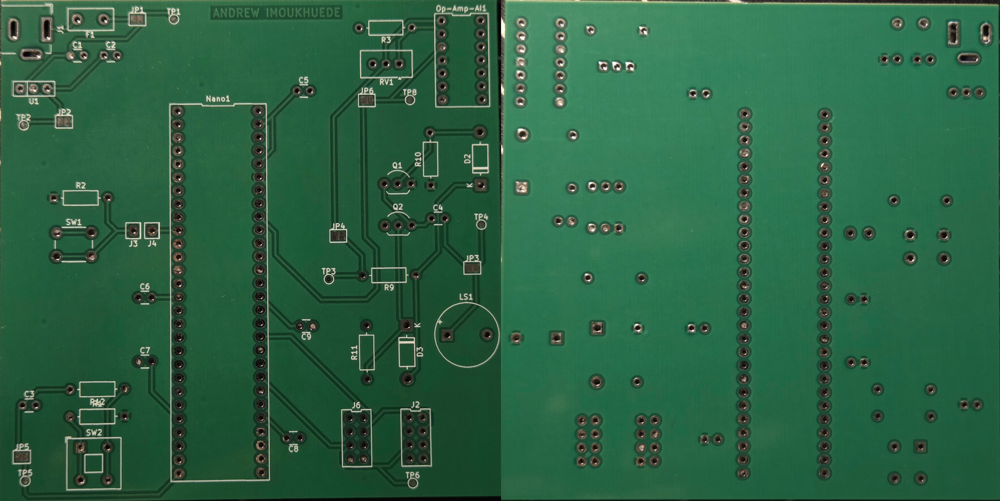
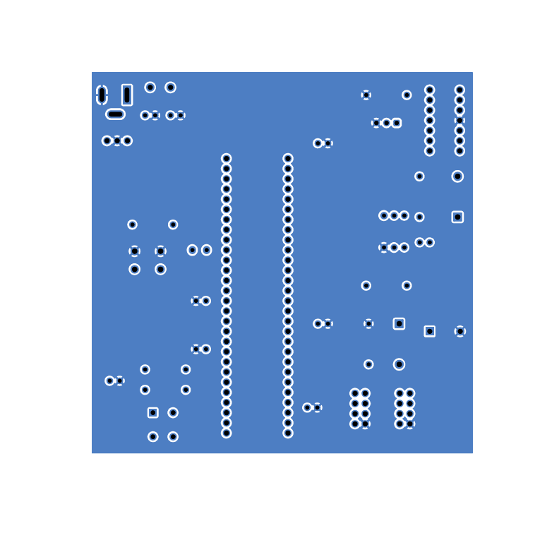

## Overview

PCB design of SubSystem Schematic. 

{style width:"350" height:"300;"}
{style width:"350" height:"300;"}
{style width:"350" height:"300;"}

**Figure 1:** PCB Design.

## Resources

- [**PCB PDF download**](PCB.pdf)
- [**Project Zip folder**](AlarmSubsystemDesign.zip)
- [**PCB Gerber Files**](Gerber.zip)
