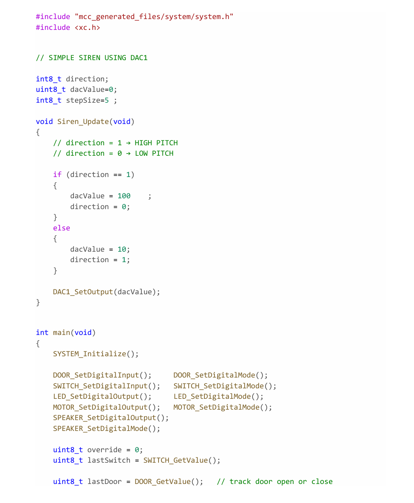
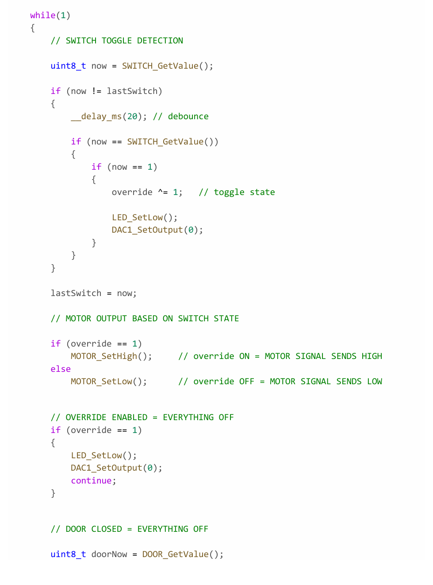
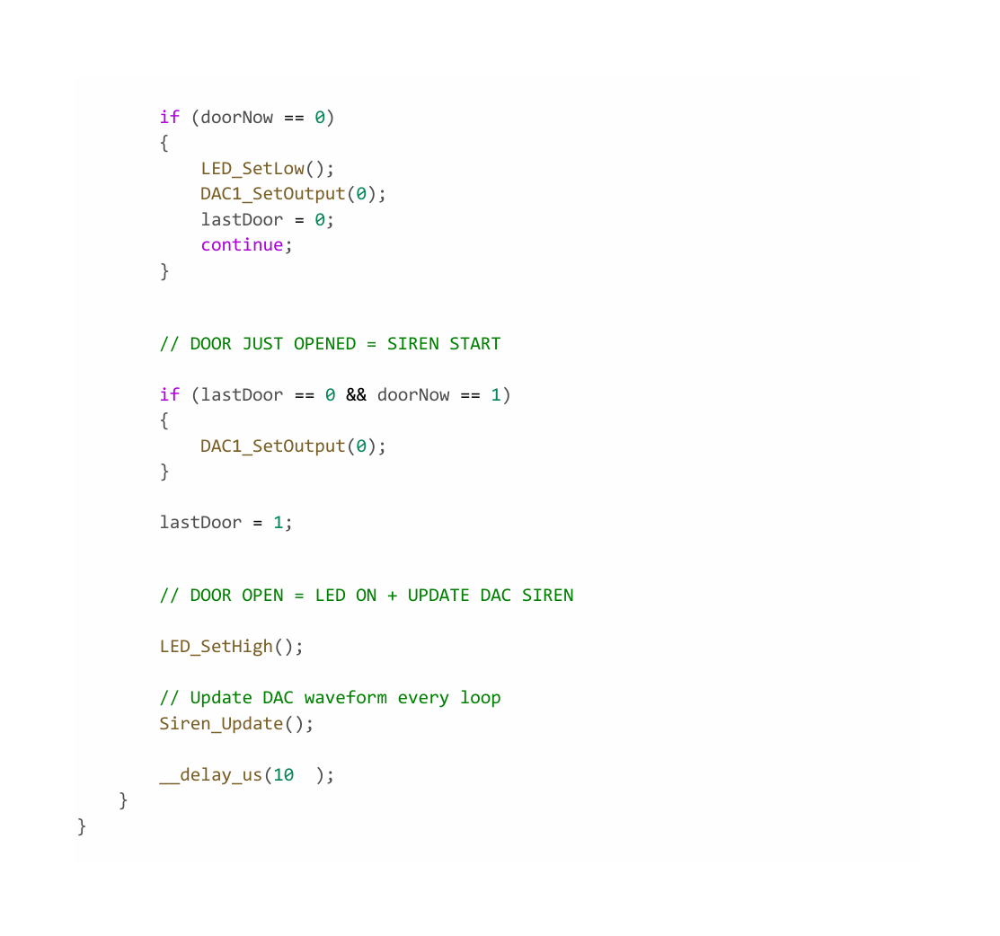

## Overview

C code used to control the logics of the Alarm Subsystem. Written and programmed with MPLAB.

{style width:"350" height:"300;"}
{style width:"350" height:"300;"}
{style width:"350" height:"300;"}
**Figure 1:** Microcontroller Code.

## Resources

- [**C Code PDF**](AlarmCode.pdf)
- [**C Code File**](AlarmCode.c)
- [**MPLAB Project Zip**](AlarmCode.zip)
